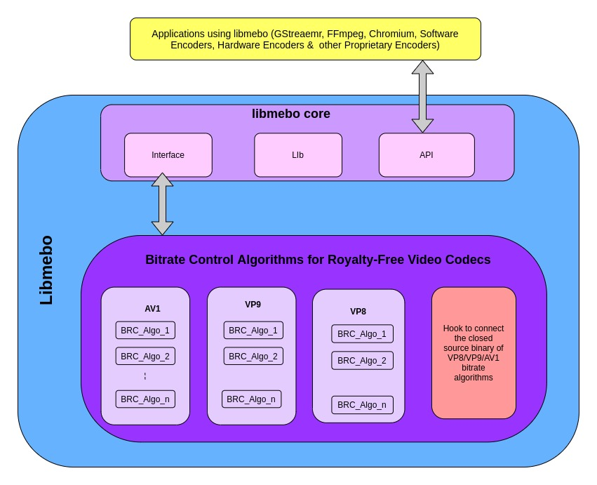
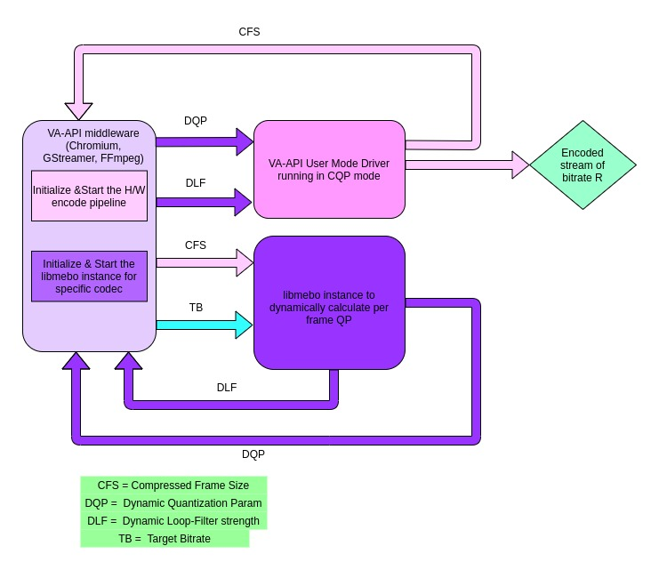

# LibMebo Explainer

# LibMebo: Library for Media Encode bitrate-control-algorithm Orchestration.

LibMebo is an open source library for orchestrating the bitrate algorithms for an encoder pipeline. The encoder itself could be running on hardware or software.

## Problem and Motivation

### Existing solutions: Pros & Cons

Hardware acceleration spec like VA-API exposes APIs to set the bitrate and the user-mode drivers are responsible for ensuring the required rate. Middleware implementations like Chromium, GStreamer, etc set the rate control mode and bitrate.

Pros:
-  Middleware doesn't have to deal with the rate control implementation
-  Rate control is running on Hardware, no overhead on CPU

Cons:
- Middleware is restricted by the limited number of algorithms implemented by each vendor on their hardware.
- More often than not, Bit Rate quality issues require fixes in hardware, firmware or media-kernels
- For codecs like VP8, VP9 & AV1, Advanced encoding models like Spatial & Temporal encodings are required to be implemented in middleware because of the limitations of the driver to providebitrate control over the above-mentioned reference picture models.
- Even though drivers come up with CBR mode support for SVC models, there are other constraints like the number of temporal and spatial layers it can support.

### LibMebo Pros & Cons

Pros:
- Middleware is no more restricted by the limited number of RC algorithms provided by Vendors.
- More control over quality & performance tuning considering the number of options provided by
software solutions.
- No need of firmware or hardware change to fix the bitrate related quality issues
- Any number of Spatial & Temporal layers can be implemented for codecs like VP8, VP9 & AV1 with a baseline encoder implementation in hardware.
- The same algorithm can be applied to different vendor hardware. Eg: AMD & Intel in Chromebook
- The same algorithms can be used in different software stacks. Eg: Gstreamer, Chromium, FFmpeg
- No need to invent new algorithms and no need to implement anything from scratch. Software
projects like libvpx already have an extensive number of options to configure the rate control based on different requirements which undergone customer testing for the last couple of years. We can utilize the same implementation for the hardware pipeline too.

Cons:
- Enablement requires changes in existing middleware. But not expecting more than 100-200
loc change.
- Little overhead on CPU since we are not offloading the BRC to GPU anymore. But mostly the BRC algorithms are not computationally intensive. So it shouldn’t be affecting the performance that much.

## How libmeebo can be integrated into the existing media stacks?

## POC for custom bitrate algrorithm injection into the existing hardware media stacks

Gstreamer: VP9 Encode: Add software based BitRate control: https://cgit.freedesktop.org/~sree/gstreamer-vaapi/commit/?h=VP9_SVC_and_SoftwareBRC&id=355f16bdb32965425b274aa082c1334b0edd5992

ChromeOS/Chromium: https://chromium-review.googlesource.com/c/chromium/src/+/2099522
JIRA: https://jira.devtools.intel.com/browse/CHRMOS-8863
